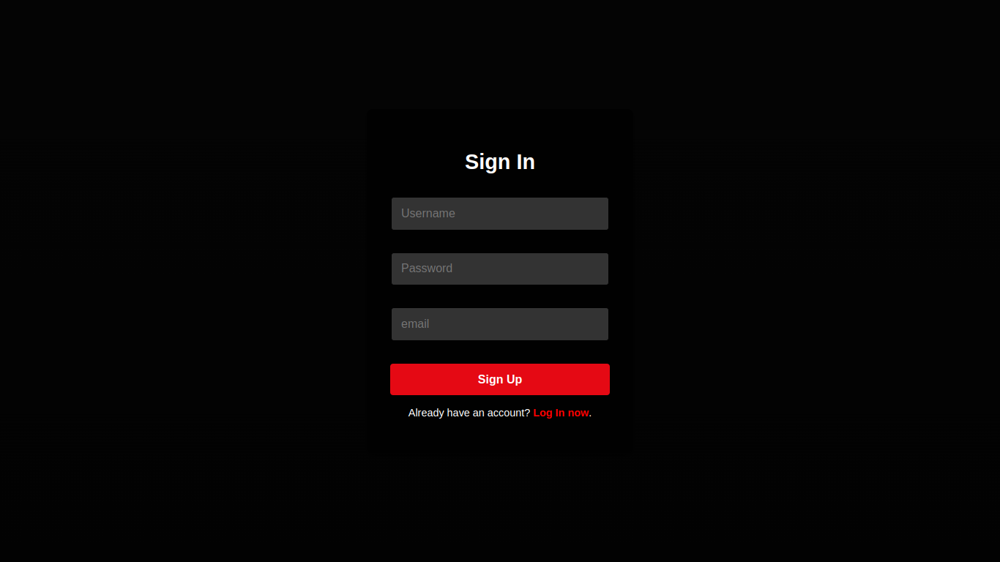
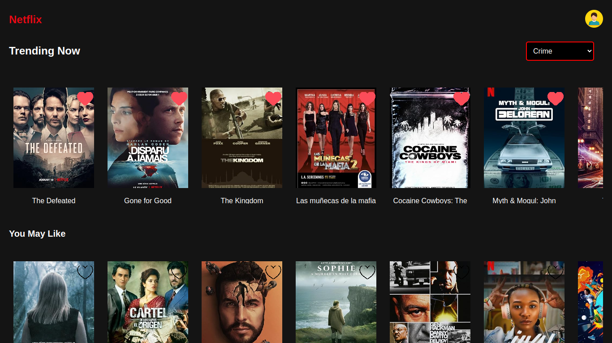

# Movie Recommendation System 🎥🎮

Welcome to the **Movie Recommendation System** project! This project is a comprehensive solution for movie enthusiasts, enabling personalized recommendations based on genres and user interactions such as liking or watching movies. Built using cutting-edge technologies like FastAPI for the backend and ReactJS for the frontend, this project demonstrates a seamless combination of machine learning, database management, and modern web development.

---

## 🖊️ Table of Contents
1. [Project Overview](#project-overview)
2. [Technologies Used](#technologies-used)
3. [How the Project Works](#how-the-project-works)
    - [Dataset & Preprocessing](#dataset--preprocessing)
    - [Database Schema](#database-schema)
4. [Running the Project](#running-the-project)
5. [How to Use the Application](#how-to-use-the-application)
6. [Screenshots](#screenshots)

---

## Project Overview

This application is designed to recommend movies to users based on their preferences. It leverages a **FastAPI backend** for efficient data handling and a **ReactJS frontend** for a smooth user experience. Users can:
- Sign up and log in securely.
- Browse movies by genre.
- Like or "watch" movies to receive tailored recommendations.
- Enjoy an intuitive interface for seamless interaction.

---

## Technologies Used

### Backend:
- **Language:** Python 🐍
- **Framework:** FastAPI 🚀
- **Database:** SQLite (for local development)

### Frontend:
- **Language:** JavaScript
- **Framework:** ReactJS ⚛️
- **Styling:** CSS

### Additional Tools:
- **Uvicorn**: To run the FastAPI server.
- **SQLAlchemy**: For ORM and database interactions.
- **npm**: For managing frontend dependencies.

---

## How the Project Works

### Dataset & Preprocessing
1. **Dataset**:
   - Collected from reliable sources containing metadata like movie title, genre, and release date.
   - Includes user interaction data to simulate recommendations.

2. **Preprocessing**:
   - Cleaned and formatted dataset.
   - Converted dates into a standard format (`%B %d, %Y`).
   - Processed genres into a relational structure for better querying.

---

### Database Schema
The SQLite database contains the following tables:
- **Users**: Stores user credentials (username, password hash).
- **Movies**: Holds movie metadata (title, genre, date added, etc.).
- **UserInteractions**: Tracks likes, watches, and other user activities.

---

## Running the Project

Follow these steps to set up and run the project on your local machine:

### Backend
1. **Navigate to the backend directory**:
   ```bash
   cd backend
   ```
2. **Install dependencies**:
   ```bash
   pip install -r requirements.txt
   ```
3. **Set up the database**:
   ```bash
   cd app/database
   python db.py
   ```
4. **Start the server**:
   ```bash
   cd ../routes
   uvicorn main:app --reload
   ```

### Frontend
1. **Navigate to the frontend directory**:
   ```bash
   cd movie-client
   ```
2. **Install dependencies**:
   ```bash
   npm install
   ```
3. **Run the frontend server**:
   ```bash
   npm start
   ```

---

## How to Use the Application

1. **Create an Account**: Sign up with a unique username and password.
2. **Login**: Use your credentials to access the app.
3. **Explore Movies**:
   - Browse movies sorted by genre.
   - Interact with movies (like or "watch").
4. **Get Recommendations**:
   - Personalized movie recommendations will appear below based on your activity.

---

## Screenshots

### Login Page



---

### Home Page



---

## 🌟 Features to Add
- **User Profiles**: A personalized dashboard with watch history.
- **Advanced Filtering**: Filter by release year, rating, and more.
- **Social Features**: Share recommendations with friends.

---

Enjoy exploring your movie recommendations! 🎥🍿
